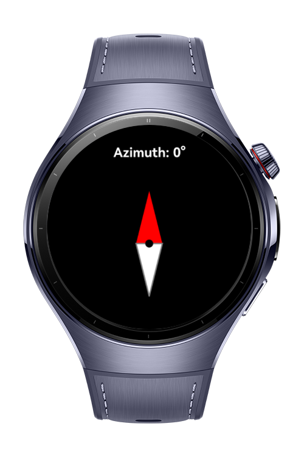

> **Note:** To access all shared projects, get information about environment setup, and view other guides, please visit [Explore-In-HMOS-Wearable Index](https://github.com/Explore-In-HMOS-Wearable/hmos-index).

# How to use sensor data for compass app

**CompassApp** is a lightweight direction-tracking application built using **ArkTS** for **HarmonyOS NEXT wearable devices**. It utilizes the `ROTATION_VECTOR` sensor to calculate azimuth values in real-time and visually rotates a compass image accordingly. Designed with a minimal UI and efficient sensor handling, it provides seamless directional feedback to the user.

# Preview
<div>

</div>

# Use Cases
- Real-time Azimuth    | Calculates azimuth angle based on rotation vector sensor data
- Rotating Compass UI  | Dynamically rotates a compass image to match device orientation
- Sensor Lifecycle     | Handles sensor registration and cleanup with lifecycle-safe methods
- Minimal Interface    | Stack + Column layout with clear azimuth display and responsive design

# Technology 
## Stack
- Languages: ArkTS, ArkUI
- Frameworks: HarmonyOS SDK 5.1.0(18)
- Tools: DevEco Studio Vers 5.1.0.828
- Libraries: @kit.ArkUI, @kit.SensorServiceKit, @kit.ArkTS

## Required Permissions
- ohos.permission.ACCELEROMETER

# Directory Structure

```
entry/src/main/ets
├── pages
│   └── Index.ets             # Main compass page
└── media
    └── compass_vector.png    # Rotatable compass image
```

# Constraints and Restrictions
## Supported Device
- Huawei Watch 5

# LICENSE
**Compass App** is distributed under the terms of the MIT License.
See the [license](/LICENSE) for more information.